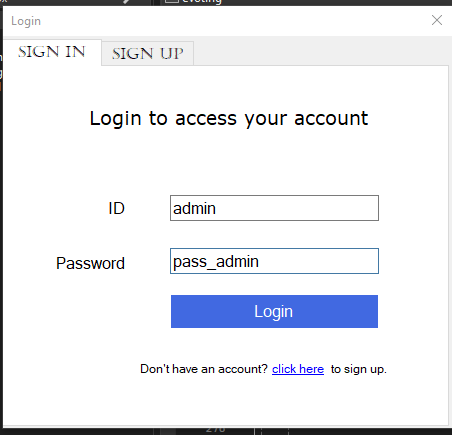
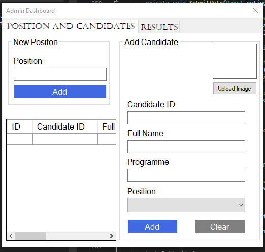
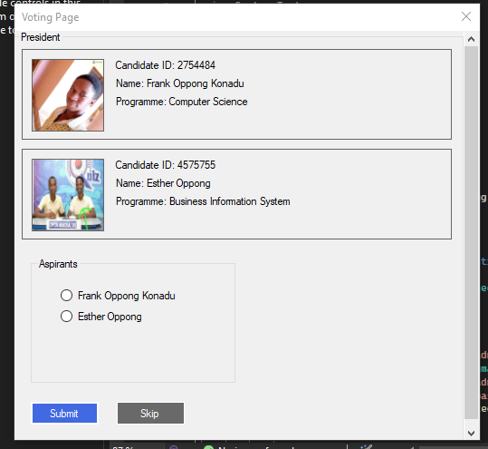
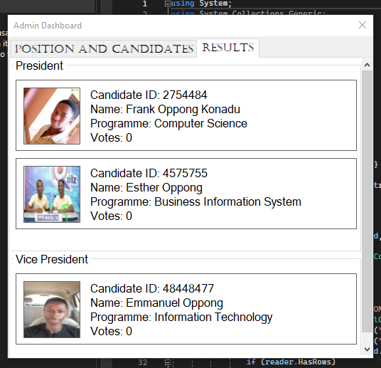

# E-VotePro

E-VotePro is a comprehensive voting system built using C# Windows Forms and MySQL, designed to facilitate secure, efficient, and transparent elections. Ideal for educational institutions, organizations, and small-scale elections, E-VotePro offers a user-friendly interface and robust functionality for managing the entire voting process.

## Table of Contents

- [Features](#features)
- [Requirements](#requirements)
- [Installation](#installation)
- [Usage](#usage)
- [Database Setup](#database-setup)
- [Screenshots](#screenshots)
- [Contributing](#contributing)
- [License](#license)

## Features

- Secure User Authentication: Supports login for both students and admins, ensuring a secure voting environment.
- Candidate Management: Admins can easily add, edit, and manage candidates.
- Real-Time Results: Provides instant feedback on election results as votes are cast.
- Admin Dashboard: Comprehensive tools for managing elections and monitoring activity.
- User-Friendly Interface: Intuitive design for easy navigation and use.
- Scalability: Suitable for various election sizes and types.

## Requirements

- Operating System: Windows 7 or later
- .NET Framework: Version 4.7.2 or higher
- MySQL Server: Version 5.7 or higher
- MySQL Connector/NET: Version 8.0 or higher

## Installation

1. Clone the repository:
   ```bash
   git clone https://github.com/Hackersgoddest/E-VotePro.git
   ```
2. Navigate to the project directory:
    ```bash
    cd E-VotePro
    ```
3. Open the project in Visual Studio:
   - Launch Visual Studio.
   - Open the solution file (`E-VotePro.sln`).

4. Install NuGet packages:
   - In Visual Studio, go to `Tools` -> `NuGet Package Manager` -> `Manage NuGet Packages for Solution`.
   - Restore the NuGet packages.

5. Configure the MySQL database:
   - Set up your MySQL database using the provided script in the `Database Setup` section.
   - Update the database connection string in `App.config`.

6. Build and run the project:
   - Click on `Build` -> `Build Solution`.
   - Run the application by clicking `Start` or pressing `F5`.

## Usage

1. Admin Login:
   - Use admin credentials to log in to the admin dashboard.
   - Manage candidates, view statistics, and monitor election activities.

2. Student Login:
   - Students can log in using their credentials to cast votes.
   - View available candidates and submit votes.

3. Election Management:
   - Admins can create and manage elections, including adding candidates and viewing elections results.

## Database Setup

To set up the MySQL database, follow these steps:

1. **Create the database and tables**:
   - Locate the `e_voting.sql` file in the root folder of this repository.
   - Open your MySQL tool (e.g., MySQL Workbench, phpMyAdmin, or a command-line client).
   - Run the `e_voting.sql` file to create the database and the necessary tables. You can usually do this by:
     - **MySQL Workbench**: Go to `File` -> `Open SQL Script`, select `e_voting.sql`, and then click `Execute`.
     - **phpMyAdmin**: Navigate to the `SQL` tab, click on `Choose File`, select `e_voting.sql`, and click `Go`.
     - **Command-line client**: Use the following command:
       ```bash
       mysql -u yourusername -p yourpassword < e_voting.sql
       ```

2. **Update the database connection string**:
   - Open the `App.config` file in your project.
   - Update the connection string with your MySQL server credentials and the name of the database created.

## Screenshots

### Login Page


### Admin Dashboard


### Voting Page


### Result Page


## Contributing

Contributions are welcome! If you'd like to contribute to this project, please follow these steps:

## License

This project is licensed under the MIT License.
